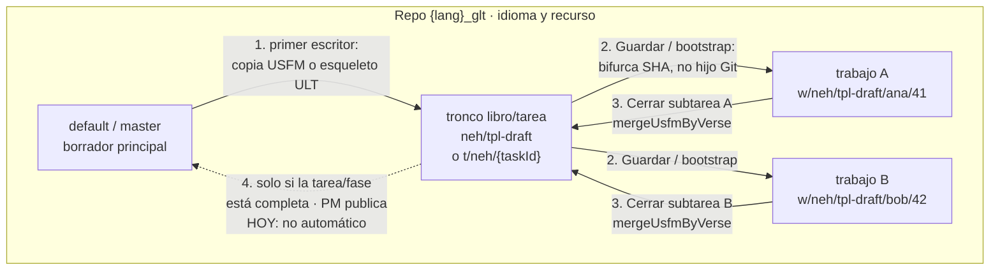
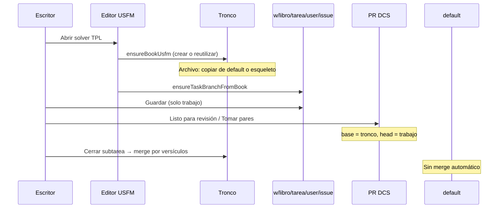

# Plan: ciclo de ramas y pruebas de colisión

> **Ejecución:** los pasos para implementar este documento, la revisión
> de gotchas contra el código y las decisiones cerradas (dónde se
> guardan los conflictos, por qué Cerrar no usa isomorphic-git, orden
> de slices) están en [`PLAN_EJECUCION_COLISIONES.md`](./PLAN_EJECUCION_COLISIONES.md).
> Este archivo sigue siendo la política.

Propuesta de **cuándo** se crea y se fusiona cada capa Git en TAS.
No implementa el flujo: documenta lo que el código hace hoy y el ciclo
recomendado. Alineado con [`MODELO.md`](./MODELO.md) y el código de
`src/dcs/bookBootstrap.ts`, `src/dcs/portionPr.ts`,
`src/domain/portionPr.ts`, `src/domain/solverLab.ts` y
`src/domain/usfmVerseMerge.ts`.

> **Estado:** plan escrito. El tronco **no** se fusiona solo a
> `master`/`default`. Las colisiones de USFM se resuelven **por
> versículo**, no por línea (abajo). Hoy el navegador fusiona con
> `mergeUsfmByVerse` + API de contenidos; isomorphic-git está en
> `usfmGitMerge.ts` y en el script de verificación, no en Cerrar.
> Las secciones 6–10 proponen la resolución automática de cada caso,
> los puentes `\v N-M` (Unir/Separar en el editor) y el orden de
> implementación. Nada de eso está en código todavía.

> **Vocabulario en la interfaz:** este documento usa términos de git,
> pero la UI de trabajadores no. Tronco = «el borrador grupal» (etiqueta
> corta «grupal»); rama `w/…` = «tu borrador» / «el borrador de {nombre}»;
> `master`/default = «el borrador principal» (sigue siendo borrador, no
> está publicado); release de Door43 = «versión publicada» (solo para un
> release real, cortado del borrador principal cuando las fases que el
> gestor eligió para esa versión están listas; las demás fases pueden
> seguir abiertas); fusionar = «guardar en el borrador grupal» (o el verbo que
> ya usa la UI: incorporar / guardar). PR,
> SHA y nombres de ref no se muestran (un enlace se llama «Abrir en
> Door43»). Solo el diálogo de Administración (QA) usa términos git.
> «Pasar al borrador principal» es la acción del gestor (Fases y tareas)
> que lleva los versículos de una tarea terminada del tronco al
> `master`/default, por versículo y en un solo commit; no crea una versión
> publicada.

---

## 1. Convenciones (producto ya acordado)

El idioma y el recurso viven en el **repositorio**, no en el nombre de
rama. Ejemplo TPL: `{contentOrg}/{lang}_glt` (p. ej. `es-419_glt`).
TPS usa `{lang}_gst`. El archivo del libro es `NN-BOOK.usfm`
(`16-NEH.usfm`).

| Capa | Nombre | Ejemplo | Notas |
|------|--------|---------|--------|
| Repo | `{lang}_glt` / `{lang}_gst` | `es-419_glt` | Recurso + idioma |
| Default | `master` (o `main`) | — | Publicación / canónico |
| Tronco (libro×tarea) | `{libro}/{tarea}` | `neh/tpl-draft` | Rama de ensamblaje |
| Tronco seguro | `t/{libro}/{tarea}` | `t/neh/6f1e771e-…` | Si `neh` ya existe como ref y bloquea el hijo Git |
| Trabajo | `w/{libro}/{tarea}/{usuario}/{issue}` | `w/neh/tpl-draft/ana/41` | **No** es hijo Git del tronco |

La fase del tablero **no** entra en refs nuevas. Quedan solo para
reutilizar leftovers: `book/neh`, `afinacion/neh`, `{faseAntigua}/neh`.

`MODELO.md` / `PLATAFORMA.md` aún citan el esquema viejo
`tas/{proyecto}/{tarea}/{issue}`. El código ya no lo **crea**; solo lo
acepta si un PR leftover lo usa.

---

## 2. Qué hace el código hoy

### 2.1 Tronco del libro — `ensureBookUsfm`

Se dispara al abrir el editor de Escritura con escritura DCS
(`ScriptureEditorView` → bootstrap) y al abrir el PR de subtarea
(`ensurePortionPr`, recursos `tpl` / `tps`).

Orden idempotente:

1. Asegura el repo de contenido.
2. Resuelve el SHA de default. Repo vacío: primer commit **en default**,
   luego rama (Gitea no crea refs sin SHA).
3. Crea `{libro}/{tarea}` desde default, o reutiliza leftover, o cae a
   `t/{libro}/{tarea}` si un padre (`neh`) bloquea el nombre.
4. Archivo USFM:
   - ya está en el tronco → **reutilizar**;
   - existe en default → **copiar** al tronco (no inventar un segundo libro);
   - falta en ambos → esqueleto con forma ULT (UST si el recurso es TPS)
     escrito **en el tronco**.

El primer escritor que abre el solver (o el PR) crea tronco + esqueleto
si el archivo no está en default. El segundo escritor reutiliza.

### 2.2 Rama de trabajo — `ensureTaskBranchFromBook`

Se crea desde el SHA del tronco, pero el nombre vive bajo `w/…` para
que Git no rechace un hijo de `neh/tpl-draft`. Momentos:

- bootstrap del editor (si `labWriteDecision` = `dcs`);
- **Guardar** (`saveUsfmOnPortionBranch`);
- `ensurePortionPr` (antes de abrir el PR).

**Guardar escribe solo en la rama de trabajo**, nunca en el tronco ni
en default.

### 2.3 PR de subtarea — `ensurePortionPr`

Un PR por issue (porción × tarea). `head` = trabajo, `base` = tronco.
Se abre al marcar el borrador (si el siguiente paso es pares/grupal),
al **Tomar** reseña, o con «Listo para revisión». Sigue abierto durante
pares. **No** se fusiona al terminar pares.

### 2.4 Trabajo → tronco — `mergePortionPrIfOpen`

Solo en **Cerrar** (Mis tareas / Entrega):

1. Lee USFM del tronco y de la rama de trabajo.
2. `mergeUsfmByVerse(tronco, [trabajo])` y escribe el resultado en el
   tronco (`TAS: fusionar versículos #N`).
3. Intenta `mergePull` de Gitea. Si falla (divergencia / no fast-forward
   tras el commit por versículos), comenta y **cierra el PR sin fusión
   lineal**. El archivo del tronco quedó ensamblado **solo si** la
   escritura del paso 2 tuvo éxito: su error se traga (6.5) y el
   comentario «Fusión por versículos aplicada» se publica igual.

Si no hay marcador de PR: `none` (el issue se cierra igual).

Versículos vacíos pierden ante llenos. Dos textos distintos en el mismo
versículo: **gana el último lado** (la subtarea que se cierra) y se
registra `conflicts[]` en memoria; **hoy no se muestra en UI**.

Esa fusión **ya es por versículo** (`chapter:verse`), no por número de
línea. isomorphic-git, si se corre solo, marca conflicto de archivo
cuando dos personas editan el mismo USFM en blanco aunque toquen
versículos distintos (las líneas `\v` vecinas chocan). Por eso el merge
Git **no** es la resolución: es el transporte. La regla semántica está
en la sección 5.

### 2.5 Tronco → default — *no existe*

No hay función que abra un PR `neh/tpl-draft` → `master` ni que copie
el USFM a default al cerrar subtareas. `#/proyectos/…/entregar`
(`PublishView`) publica **issues** (lotes), no el libro canónico.

**Hoy el tronco nunca se fusiona solo a master.**

---

## 3. Ciclo recomendado (propuesta)

Misma topología que el código. Lo que cambia es **cuándo** el libro
llega a default, y dejar explícito que Cerrar no publica.

| Evento | Cuándo (recomendado) | Hoy en código |
|--------|----------------------|---------------|
| Crear **tronco** | Primer escritor de esa tarea que necesita USFM (abre solver DCS o PR) | Igual (`ensureBookUsfm`) |
| Crear **archivo USFM** | Mismo momento: copiar de default si existe; si no, esqueleto ULT en el tronco | Igual |
| Crear **rama de trabajo** | Primer **Guardar** (o bootstrap DCS / abrir PR) | Igual; el bootstrap ya la crea al cargar |
| **Guardar** | Solo `w/…` | Igual |
| Abrir **PR** | Al salir a reseña (pares/grupal o «Listo para revisión») | Igual |
| Fusionar **trabajo → tronco** | **Cerrar subtarea** (entrega), fusión por versículos | Igual |
| Fusionar **tronco → default** | Solo cuando la **tarea** (o la fase del proyecto) está completa y un PM **publica el libro** — nunca al cerrar cada subtarea | **No implementado** |

### 3.1 Regla segura: tronco → default

**Recomendación (no código):**

1. Default es el libro **publicado**. El tronco es el ensamblaje de la
   tarea en curso.
2. No fusionar el tronco a default al Cerrar una subtarea. Un lote
   cerrado no implica que el libro esté listo; otras porciones siguen
   abiertas.
3. Disparador: el PM (o un paso explícito «Publicar libro») cuando
   **todas** las subtareas de esa tarea están cerradas, o cuando se
   cierra la fase. Un PR `tronco → default`, revisión humana, merge.
4. Si default ya tiene el libro (recurso publicado), el siguiente
   tronco **copia** ese archivo; no se crea un segundo `16-NEH.usfm`.
5. Varias tareas del mismo libro (TPL luego afinación) = **troncos
   distintos** (`neh/tpl-draft`, `neh/afinacion`). Cada uno se publica
   a default al terminar *esa* tarea, no al mezclar fases.

Hasta que exista esa acción de PM, el USFM canónico para colaboradores
es el **tronco**, no `master`.

---

## 4. Diagrama



Secuencia típica de una subtarea:



---

## 5. Colisiones: isomorphic-git + versículo (no línea)

Un USFM de libro es **un archivo**. Git (y isomorphic-git) compara
**líneas**. Dos personas que parten del mismo esqueleto en blanco y
llenan versículos distintos casi siempre producen un conflicto de
archivo: ambos reescribieron el mismo bloque `\v` / `\p`, aunque no
compartan versículo. Eso es una **falsa colisión**.

La resolución que usaremos:

1. **isomorphic-git** hace el three-way (`base`, `ours`, `theirs`) del
   archivo en un worktree en memoria (`mergeUsfmBranchesWithGit`).
   Recibe los tres textos ya leídos (no trae nada de DCS), arma un repo
   sintético y solo sirve para ver si Git choca; su archivo resultante
   se descarta. `abortOnConflict: false`: un conflicto de líneas **no**
   aborta el ensamblaje.
2. **No** se acepta el resultado textual de Git si hay marcadores
   `<<<<<<<`. Esos marcadores aparecen justo en el caso en blanco.
3. Se vuelve a armar el libro con
   `mergeUsfmByVerse(ours, [theirs], { ancestor: base })` (ours = tronco,
   theirs = entrante): cada slot es `(capítulo, desde, hasta)`, no la
   línea del archivo. El helper devuelve `gitLineConflict` para mostrar
   que Git chocó; nunca lee ni devuelve el archivo del worktree.
4. Reglas del slot:

   | Textos del mismo verso | Resultado | ¿Colisión? |
   |------------------------|-----------|------------|
   | Ambos vacíos | Hueco `\v N` | No |
   | Uno vacío, uno con texto | Queda el texto | No (el blanco no compite) |
   | Los dos iguales | Ese texto | No |
   | Los dos con texto **distinto** | Se conserva el último lado y se registra `conflicts[]` | **Sí** — mismo versículo |

5. El archivo resultante tiene **un** `\v` por versículo, en orden de
   libro. Dos porciones disjuntas en un esqueleto vacío **no** son
   conflicto, aunque Git haya dicho que sí.
6. `conflicts[]` hay que **mostrarlo** al cerrar (hoy se calcula y se
   descarta al escribir el tronco). Hasta esa UI, el plan de prueba
   verifica el archivo: el verso en disputa tiene un solo texto y el
   otro verso ajeno sigue. Qué se persiste y qué bloquea: sección 6.

El script `verify-usfm-merge.mts` exige que
`mergeUsfmBranchesWithGit` **no** trate como conflicto dos porciones
que no se solapan, y prueba que Git choca por líneas
(`gitLineConflict`) donde la fusión por versículos no ve conflicto.

**Cerrar no usa isomorphic-git, por decisión.** `mergePortionPrIfOpen`
lee el tronco, la rama de trabajo y el ancestro (`pull.merge_base`) con
la API de contenidos, llama `mergeUsfmByVerse(tronco, [trabajo],
{ ancestor, scope })` con el alcance de la porción del issue y escribe
el resultado en el tronco (reintento por SHA, máx. 3). isomorphic-git
queda como prueba de transporte en el script, fuera del navegador.

---

## 6. Resolución automática por caso (propuesta)

Principio: **la máquina decide siempre que una regla pueda decidir sin
leer la traducción**. Solo se detiene cuando dos personas escribieron
textos distintos para el mismo versículo ocupado (sección 8). El USFM
del tronco **nunca** lleva marcadores `<<<<<<<` / `=======` / `>>>>>>>`:
siempre queda un libro válido y fusionable.

### 6.1 Qué compara la regla

Antes de comparar dos textos de un slot:

1. `stripAlignment` (ya existe): fuera `\zaln-*`, `\w …|…\w*`, marcas.
2. Espacios colapsados y `trim` (ya lo hace `stripAlignment`).
3. **Nuevo:** normalizar a **NFC** (`text.normalize("NFC")`) antes de
   comparar y al escribir. Una `é` precompuesta y una `e` + acento
   combinante son el mismo texto; hoy `pickText` las cuenta como
   conflicto. Recomendación: sí, automático, sin UI.

**Solo compite un lado que aporta**: texto no vacío y, cuando se conoce
el ancestro común, distinto del ancestro (6.3). Un lado vacío o sin
cambios no pelea con nadie.

### 6.2 Tabla de casos

| # | Caso | Regla automática | ¿Para a una persona? | Hoy en código |
|---|------|------------------|----------------------|---------------|
| 1 | Versículos disjuntos sobre esqueleto vacío | Unión en orden de libro | No | Sí (`mergeUsfmByVerse`) |
| 2 | Mismo bloque de líneas / mismo hunk Git, versículos distintos | Ignorar el conflicto de líneas; resolver por slot | No | Sí en `usfmGitMerge.ts`; Cerrar no usa Git |
| 3 | Vacío contra lleno | Gana el lleno; no es conflicto | No | Sí (`pickText`) |
| 4 | Mismo texto tras `trim` (+ NFC) | Ese texto; no es conflicto | No | Solo `trim`; falta NFC |
| 5 | Mismo versículo, textos distintos | Se escribe el **último lado** (la subtarea que cierra) y se **persiste** `conflicts[]` (6.4) | **Sí, después**: revisión antes de «Publicar libro», no antes de Cerrar | Último lado sí; `conflicts[]` se descarta |
| 6 | Solo formato: `\p` vs `\q`, líneas en blanco, `\zaln`/`\w` | No es conflicto de traducción; se compara texto plano | No | Sí (texto plano; reescribe un `\p` por capítulo) |
| 7 | Cabecera `\id` / `\h` / `\toc` distinta | Gana la cabecera del **tronco**; si el tronco no tiene `\id`, la primera de los lados | No | Sí (`bookHeader(base) \|\| …`) |
| 8 | `\v` duplicado con el mismo número en un archivo | Gana el **último** del archivo; **aviso** de validación, no un segundo slot | No | Último gana (`Map.set`); falta el aviso |
| 9 | Dos Cerrar a la vez (SHA del tronco cambió) | Releer tronco, volver a fusionar, reintentar (máx. 3) | No; si agota reintentos, **no** cerrar el issue | **No**: el error se traga (6.5) |
| 10 | Puente `\v N-M` contra esqueleto o rangos disjuntos | Ver sección 7 | No | **No**: el puente se pierde |
| 11 | Puente contra versos separados, **ambos con texto** | Conflicto estructural; el tronco no cambia en ese rango | **Sí** | **No** |

### 6.3 Ancestro común: no sobrescribir con texto viejo

Hoy Cerrar llama `mergeUsfmByVerse(tronco, [trabajo])` sin ancestro.
El texto del tronco es un candidato más y el trabajo es «el último».
Con esqueleto vacío no pasa nada, pero con un libro ya lleno (caso C:
default publicado, o afinación) hay una **sobrescritura silenciosa**:

1. El tronco copia el borrador principal: 1:10 = «O».
2. Ana y Bob bifurcan; ambas ramas `w/…` tienen «O» en todo el libro.
3. Ana cierra 1:10–11 → tronco 1:10 = «A».
4. Bob cierra 1:12–13. Su rama todavía tiene «O» en 1:10.
   `pickText(["A", "O"])` → conflicto y **gana «O»**. Ana perdió 1:10.

Propuesta, en dos capas (las dos automáticas):

- **Alcance de la porción (arreglo pequeño, primero):** en Cerrar, el
  lado del trabajo solo aporta los versículos de la referencia del
  issue. En Cerrar no hay `ctx`: el rango sale del título del issue
  (`parseRefRange(refFromIssueTitle(issue.title))`, la misma fuente que
  usa el editor vía `buildSolverLaunchContext`). Coincide con lo que Guardar
  escribe (`applyVerseEdits` solo toca `drafts` del rango). Lo demás de
  la rama `w/…` se ignora.
- **Tres vías por slot (arreglo correcto):** ancestro = blob del tronco
  en el SHA donde se bifurcó el trabajo (merge-base del PR). Un lado
  cuyo slot es igual al ancestro **no compite**. Solo es conflicto si
  **ambos** cambiaron respecto al ancestro y quedaron distintos.
  `mergeUsfmBranchesWithGit` ya recibe `baseUsfm`: pasarlo como
  ancestro, no como un lado más.

### 6.4 Colisión real (caso 5): qué escribe Cerrar

**Default recomendado:** Cerrar **no se bloquea**. Escribe el último
lado (comportamiento actual, el libro queda válido) y **persiste**
`conflicts[]`:

- comentario en el issue PM y en el PR con, por slot: capítulo, rango,
  texto que quedó, texto(s) desplazado(s) y número de issue de cada
  uno; con un marcador máquina (p. ej. `<!-- tas:verse-conflicts {…} -->`)
  para que una futura UI los liste sin reparsear USFM;
- la rama `w/…` del lado desplazado **no se borra** mientras haya
  conflicto pendiente (su texto sigue recuperable);
- **«Publicar libro»** (tronco → default, sección 3.1) se bloquea
  mientras el tronco tenga conflictos sin resolver.

Por qué no bloquear Cerrar: el tronco no es el borrador principal, otras
porciones siguen en curso, y bloquear dejaría issues abiertos por una
decisión que el PM puede tomar después con ambos textos delante.

Forma propuesta del registro (extiende `VerseConflict`):

| Campo | Contenido |
|-------|-----------|
| `chapter`, `from`, `to` | Rango ocupado (single: `from = to`) |
| `kind` | `texto` (mismo slot) o `estructura` (puente vs separados) |
| `candidates[]` | `{ issue, from, to, text }` por lado entrante; el lado del tronco va como `tronco` (la API de contenidos no dice qué issue escribió ese texto) |
| `kept` | `ultimo` (caso 5) o `tronco` (caso 11) |

### 6.5 Concurrencia de Cerrar (caso 9)

En `mergePortionPrIfOpen` el `catch` alrededor de `writeRepoFile` es
silencioso y sigue a `mergePull`; si Gitea tampoco fusiona, el PR se
cierra sin fusión y **los versículos no llegan al tronco**. Propuesta:
si `writeRepoFile` falla por SHA, releer el tronco, repetir
`mergeUsfmByVerse` con el blob nuevo y reintentar (máx. 3). Si agota
reintentos, devolver error y **no** cerrar el issue. No es un conflicto
de versículo.

### 6.6 Normalización TAS (caso 6)

El editor de Escritura de TAS guarda **texto plano por versículo**. Para
los libros que TAS arma:

- un `\p` tras cada `\c` (lo que ya hace `mergeUsfmByVerse`);
- un `\v` por línea, texto en una sola línea, NFC;
- sin `\zaln` / `\w` ni notas: alineación, `\f`, `\x`, `\q`, `\s` y
  segmentos `\v 10a` quedan **fuera del alcance** de este fusionador
  hasta que exista un editor enriquecido.

Riesgo conocido: si el tronco copia un borrador principal con poesía,
títulos o notas (caso C), la reescritura plana los aplana y
`stripAlignment` mete el texto de `\f … \f*` dentro del versículo. No
se resuelve aquí; se documenta como hueco (sección 12).

---

## 7. Puentes de versículos `\v N-M`

### 7.1 Por qué importa

`\v 10-11` es USFM válido: un versículo combinado (puente). Las
porciones de Gateway suelen ser rangos (Neh 1:10–11 asignado junto) y
unirlos en el USFM meta es una **decisión del traductor**, no un
accidente de fusión: a veces la lengua meta solo suena natural si
ambos versos se traducen como una sola unidad.

Hoy:

- el borrador (`scripture-editor__draft`) pinta un `textarea` por
  número (`VerseDraft = { verse, text }`, `placeholderDrafts` recorre
  `from…to`); 10 y 11 son dos filas;
- `listVerseSpans` **lee** el `-11` en la regex pero lo descarta: la
  clave es solo 10;
- `extractDraftVerses` (vía AST o `extractVerseEdits`) pone el texto
  del puente en el 10 y deja el 11 vacío/ausente;
- `applyVerseEdits` reescribe el 10 como `\v 10 …` (pierde el `-11`) y,
  si el 11 no existe, lo **añade al final del capítulo** (fuera de
  orden);
- `mergeUsfmByVerse` escribe `\v ${verse}` con el primer número: el
  puente desaparece al Cerrar;
- `skeletonUsfmFromSource` también usa solo `span.verse`: si la fuente
  ULT/UST trae un puente, el esqueleto pierde el número final.

### 7.2 Autoría: Unir / Separar en el borrador

Cambio mínimo de UI (no implementado), sobre las filas de
`scripture-editor__draft`:

| Acción | Dónde | Efecto en el borrador |
|--------|-------|-----------------------|
| **Unir con N+1** | Botón pequeño en `scripture-editor__verse-head` de la fila N, solo si la fila N+1 existe **en la porción** y es contigua | Las filas N y N+1 se reemplazan por **una** fila `N–N+1` con un solo `textarea`. Si ambas tenían texto, se concatenan en orden con un espacio (nada se pierde; el traductor edita) |
| **Unir** repetido | En una fila `N–M`, si M+1 está en la porción | Crece a `N–M+1` |
| **Separar** | En una fila `N–M` | Vuelven las filas N…M; el texto queda en N y el resto vacío, con aviso «Reparte el texto entre los versículos» |

Restricciones:

- solo números **contiguos** (10–11, 10–12), nunca 10+12 con hueco;
  USFM expresa el puente como rango `N-M`, no como lista;
- solo dentro del rango de la porción y del mismo capítulo; no se puede
  unir 11 de mi porción con 12 de otra;
- el primer sitio donde se ofrece es una porción exacta de dos versos
  (p. ej. Neh 1:10–11), el caso del DOM citado.

Modelo de datos del borrador: `VerseDraft` pasa a
`{ from, to, text }` (`to = from` para un verso simple). El caché local
(`draftCache`, hoy `Record<number, string>`) se indexa por `"10"` o
`"10-11"`. La etiqueta visible es `10–11` y el `title` `1:10–11`.

**Resultado USFM al Guardar:** una sola línea

```
\v 10-11 Texto combinado de los dos versículos.
```

y **no** existen además `\v 10` ni `\v 11` en ese capítulo.
`applyVerseEdits` debe reemplazar todo el tramo de spans que ocupe
10…11 por esa línea (y a la inversa al Separar: `\v 10 …` y `\v 11`
en orden, en el lugar del puente, no al final del capítulo).

### 7.3 Identidad para la fusión: slot = rango

Hoy la clave es `capítulo:primer número`. Para puentes eso es
incorrecto: `\v 10-11` sería la clave 10 y el 11 otra clave distinta.

Modelo propuesto:

- un **slot** es `(capítulo, desde, hasta)`; `\v K` → `(c, K, K)`;
  `\v N-M` → `(c, N, M)` con `N < M`;
- el slot **ocupa** todos los enteros N…M como **una** unidad; no son
  versos independientes;
- `listVerseSpans` devuelve `verseTo` (o `to`) además de `verse`;
- orden de libro: por capítulo y luego por `desde`;
- dos slots de lados distintos **se tocan** cuando sus conjuntos
  ocupados se **intersecan**.

Fusión por capítulo: agrupar los slots de todos los lados en
**grupos** de slots que se intersecan (componentes conexas). Cada grupo
se resuelve solo, con estas reglas:

| # | Situación en el grupo | Resultado automático | ¿Conflicto? |
|---|-----------------------|----------------------|-------------|
| P1 | Rangos disjuntos (p. ej. A `\v 10-11 X`, B `\v 12 Y`) | Cada slot en su lugar, en orden; un puente **no** se parte en versos sueltos | No |
| P2 | Un lado `\v 10-11 X`; el otro `\v 10` y `\v 11` **vacíos** (esqueleto) | Gana el puente: `\v 10-11 X`; los vacíos no compiten y desaparecen | No |
| P3 | Inverso: tronco con puente lleno; lado con `\v 10`, `\v 11` vacíos (se separó sin escribir) | Queda el puente lleno | No |
| P4 | Mismo rango en ambos (`\v 10-11`), mismo texto (NFC) | Ese texto | No |
| P5 | Mismo rango en ambos, textos distintos | Como el caso 5: último lado + `conflicts[]` (`kind: texto`) | Sí, revisión posterior |
| P6 | Solo **un** lado aporta texto en el grupo, sea puente o versos separados | Gana esa forma y ese texto (puente o separados) | No |
| P7 | Aportes de lados distintos **sin** intersección entre sí (p. ej. tronco con puente `10-11` vacío; A llena `\v 10`, B llena `\v 11`) | Se colocan los slots con texto; el puente vacío pierde | No |
| P8 | Un lado `\v 10-11 X` y el otro `\v 10 a` **y/o** `\v 11 b` con texto en un número que se interseca | **Conflicto estructural** (`kind: estructura`): el tronco **no cambia** en ese rango; se registran ambos candidatos | **Sí, manual** |
| P9 | Puentes solapados distintos, ambos con texto (`10-11 X` vs `11-12 Y`) | Igual que P8 | **Sí, manual** |

Números del grupo sin ningún slot con texto: se escriben con la forma
del tronco si no se interseca con un slot lleno; si no, como `\v K`
vacíos. Así el libro sigue teniendo cada número exactamente una vez.

**Regla explícita para implementadores (P8/P9):** no concatenar, no
aplicar «último gana» entre un puente y versos separados, y no partir el
puente para repartir el texto. Son dos estructuras distintas (una
unidad vs dos) y elegir una es una decisión de traducción. El default
automático es **no decidir**: el tronco conserva lo que tenía en ese
rango (si el tronco es uno de los lados en disputa, su forma queda; si
no tenía texto, queda el hueco), el candidato entrante vive en
`conflicts[]` y en su rama `w/…`, y «Publicar libro» queda bloqueado.
Nunca se escriben marcadores de conflicto en el USFM.

Con ancestro (6.3), «aporta texto» significa «texto no vacío y distinto
del ancestro». Ejemplo: el ancestro tenía `\v 10-11 X`, el tronco sigue
igual y el lado separó en `\v 10 a` / `\v 11 b` → solo aporta el lado
(P6): gana la separación. Sin ancestro, ese mismo caso cae en P8.

---

## 8. Qué queda manual

Todo lo de las tablas 6.2 y 7.3 es automático salvo:

1. **Dos traducciones distintas no vacías del mismo slot** (casos 5 y
   P5). Se escribe el último lado para que el libro siga válido, pero
   alguien debe confirmar o cambiar el texto antes de publicar.
2. **Puente contra versos separados, o puentes solapados, cuando ambos
   lados tienen texto** en un número común (P8, P9). No se escribe
   ninguno de los dos candidatos entrantes; el tronco no cambia en ese
   rango hasta que una persona elija.

Quién resuelve: el PM o el revisor de la tarea, desde la futura UI de
`conflicts[]` (o, mientras no exista, editando el tronco con los textos
del comentario del issue). La resolución borra el marcador y desbloquea
«Publicar libro».

---

## 9. Orden de implementación (propuesta, sin código)

0. **Corrección previa pequeña:** en Cerrar, limitar el aporte del
   trabajo a la referencia del issue (6.3) y reintentar por SHA (6.5).
   Evita perder texto ya cerrado sobre un libro lleno.
1. **Slots con rango** en `listVerseSpans` (`verseTo`) y en
   `mergeUsfmByVerse` (grupos de intersección, reglas P1–P9, NFC,
   ancestro opcional como tercer argumento). `skeletonUsfmFromSource`
   conserva `\v N-M` de la fuente. `conflicts[]` con `kind` y
   `candidates`.
2. **Pruebas** en `scripts/verify-usfm-merge.mts` (sección 10) antes de
   tocar UI: disjuntos, vacío-vs-puente, mismo verso distinto texto,
   puente-vs-dos-versos-llenos.
3. **Editor Unir / Separar** en filas contiguas del borrador:
   `VerseDraft { from, to, text }`, `draftCache` por rango,
   `extractDraftVerses` devuelve filas con rango (la vía AST lee
   `number: "10-11"`; hoy `verseNumberFromNode` se queda con el primer
   número), `applyVerseEdits` reemplaza el tramo completo.
4. **Cerrar persiste `conflicts[]`** (comentario + marcador en issue y
   PR), conserva la rama `w/…` desplazada y bloquea «Publicar libro»
   con conflictos pendientes. Nunca escribe `<<<<<<<` en el USFM.
5. **isomorphic-git solo como transporte:** `mergeUsfmBranchesWithGit`
   usa la misma fusión de tres vías que Cerrar y solo informa si Git
   chocó. Cerrar **no** lo llama (decisión, no hueco): obtiene ancestro
   / tronco / trabajo por la API de contenidos y escribe
   `mergeUsfmByVerse(tronco, [trabajo], { ancestor, scope })`.

---

## 10. Casos nuevos para `verify-usfm-merge.mts`

Nombres de caso y lo que se afirma (sin código de prueba).

| Caso | Entrada | Se afirma |
|------|---------|-----------|
| `disjuntos-esqueleto` (ya existe) | A 1:1–2, B 1:3 + 2:1 sobre esqueleto | Unión ordenada; `conflicts = []` |
| `mismo-hunk-versos-distintos` | A llena 1:1, B llena 1:2 (líneas vecinas) vía `mergeUsfmBranchesWithGit` | Sin conflicto de versículo aunque Git choque |
| `vacio-vs-lleno` | Base vacía en 1:2, un lado con texto | Queda el texto; sin conflicto |
| `identico-trim-nfc` | `é` precompuesta vs `e`+U+0301, espacios finales | Sin conflicto; salida en NFC |
| `mismo-verso-distinto-texto` | A y B con textos distintos en 1:2 | Un solo `\v 2` con el texto del último lado; `conflicts` = 1 con ambos textos |
| `formato-no-es-conflicto` | Un lado con `\q1` y `\zaln`/`\w`, otro plano, mismo texto | Sin conflicto; un `\p` por capítulo |
| `cabecera-tronco` | Tronco y lado con `\h` distinto; luego tronco sin `\id` | Gana el tronco; sin `\id` gana el lado |
| `verso-duplicado` | Archivo con dos `\v 3` | Queda el último; aviso de validación |
| `span-parse` | `\v 10-11 X` y `\v 12 Y` | `listVerseSpans` da `10–11` y `12–12` |
| `span-vs-esqueleto` | Base `\v 10`, `\v 11` vacíos; lado `\v 10-11 X` | Una línea `\v 10-11 X`; no hay `\v 10` ni `\v 11` sueltos; sin conflicto |
| `span-disjunto` | A `\v 10-11 X`, B `\v 12 Y` | Ambos, en orden; el puente no se parte |
| `span-igual` | Ambos `\v 10-11 X` | Sin conflicto |
| `span-mismo-rango-distinto-texto` | A `\v 10-11 X`, B `\v 10-11 Z` | Último lado; `kind: texto` |
| `span-vs-dos-llenos` | A `\v 10-11 X`, B `\v 10 a` + `\v 11 b` | `kind: estructura` en 10–11; tronco sin cambios en ese rango; ni concatenación ni último gana |
| `span-vs-uno-lleno` | A `\v 10-11 X`, B `\v 10` vacío + `\v 11 b` | `kind: estructura` |
| `spans-solapados` | A `\v 10-11 X`, B `\v 11-12 Y` | `kind: estructura` en 10–12 |
| `span-vacio-pierde` | Tronco `\v 10-11` vacío; A llena `\v 10`, B llena `\v 11` | `\v 10 a`, `\v 11 b`; sin conflicto |
| `separar-con-ancestro` | Ancestro y tronco `\v 10-11 X`; lado `\v 10 a` + `\v 11 b` | Gana la separación (solo aporta el lado) |
| `unir-separar-roundtrip` | `applyVerseEdits` con puente sobre esqueleto, luego separar | Exactamente un `\v 10-11`; al separar, `\v 10` y `\v 11` en su lugar, no al final del capítulo |
| `esqueleto-con-puente-fuente` | Fuente ULT con `\v 10-11` | El esqueleto conserva `\v 10-11` vacío |
| `libro-lleno-no-sobrescribe` | Tronco con libro «O»; A cierra 1:10 → «A»; B (bifurcado antes) cierra 1:12 | 1:10 sigue «A» (alcance de porción o ancestro) |
| `sin-marcadores` | Todas las salidas anteriores | Ninguna contiene `<<<<<<<`, `=======` ni `>>>>>>>` |

---

## 11. Plan de pruebas de colisión

Objetivo: el mismo tronco recibe dos escritores y el `16-NEH.usfm` del
tronco queda en orden de libro. **Falsa colisión** (versos distintos
sobre esqueleto vacío) se ensambla sola. **Colisión real** = mismo
`capítulo:versículo` con dos textos.

**Org de prueba.** Nunca `es-419_gl`. El laboratorio bloquea orgs
`*_gl` salvo `labUnsafeWrite`. Usar un slug con `test`, `sandbox`,
`lab` o `local` (p. ej. `tas-lab-test`).

### 11.1 Unidad local (siempre primero)

```bash
npx tsx scripts/verify-usfm-merge.mts
```

Cubre, sin DCS:

- esqueleto ULT de NEH (huecos, sin texto inglés);
- dos «ramas» con porciones **disjuntas** (A: 1:1–2; B: 1:3 + 2:1);
- `mergeUsfmByVerse` conserva orden `1:1…2:2` y no tira el 2:2 vacío;
- `mergeUsfmBranchesWithGit` (isomorphic-git + `mergeUsfmByVerse`)
  **no** deja conflicto si los versículos no se solapan, aunque el
  merge de líneas de Git haya chocado en el esqueleto en blanco.

Los casos que faltan (NFC, puentes, libro lleno, etc.) están en la
sección 10.

Si este script falla, no seguir a DCS.

### 11.2 Laboratorio — qué sí y qué no

`#/lab` arma un `ctx` con `lab: true`, `taskId` vacío e
`issueNumber = 0`. Por defecto el borrador es **local**: no crea ramas,
PRs ni issues.

Con «Permitir escritura DCS» + org de prueba:

| Acción | ¿Lab lo hace? |
|--------|----------------|
| Crear tronco + esqueleto / copiar USFM | Sí (`ensureBookUsfm`) |
| Crear `w/…` y Guardar | Sí, pero `taskId` vacío → tronco `neh/tarea` y trabajo `w/neh/tarea/{user}/0` |
| Abrir PR | No (no hay issue PM) |
| Fusionar trabajo → tronco | No (no hay **Cerrar** de subtarea) |
| Pares / grupal | No (`solverNeedsRealIssue`) |

El lab sirve para **humedad de bootstrap** (¿se creó el tronco? ¿el
archivo?) y para dos sesiones que **guardan** en ramas `w/…` distintas.
**No** sustituye la fusión. Para colisión real hacen falta **dos
subtareas** publicadas en org de prueba.

### 11.3 Dos subtareas reales (org de prueba)

Preparación (una vez):

1. Org DCS de prueba (no `es-419_gl`). Repo TPL `{lang}_glt` vacío o
   con default sin `16-NEH.usfm` (o con un libro ya publicado, para
   probar la rama «copiar»).
2. Org PM de prueba + proyecto NEH + tarea TPL (`tpl-draft` o el
   `taskId` del tablero).
3. Publicar **dos** subtareas del **mismo** libro y **misma** tarea:
   - **Disjuntas:** A = Neh 1:10–11, B = Neh 1:12–13 (o 2:1).
   - **Solapadas:** A = Neh 1:10–12, B = Neh 1:11–13 (el 1:11–12 se pisan).
4. Dos usuarios (o dos sesiones) con permiso de push en el repo TPL.

No hace falta implementar nada nuevo: Mis tareas + editor + Cerrar.

#### Caso A — versículos disjuntos sobre esqueleto vacío (falsa colisión Git)

Debe **pasar sin pedir resolución**. Git verá conflicto de líneas; TAS
no.

1. Ana abre #41, escribe 1:10–11, **Guardar**.
   Esperado: tronco `neh/tpl-draft` (o `t/neh/…`); trabajo
   `w/neh/tpl-draft/ana/41`; default **sin** esos versos (salvo que ya
   existiera el libro).
2. Bob abre #42, escribe 1:12–13, **Guardar**.
   Esperado: mismo tronco; trabajo `w/neh/tpl-draft/bob/42`. El archivo
   de Ana **no** cambia.
3. Ana **Cierra** #41.
   Esperado: tronco tiene 1:10–11 de Ana; 1:12–13 siguen hueco; PR #41
   cerrado/fusionado.
4. Bob **Cierra** #42.
   Esperado: tronco tiene 1:10–13 en orden; un solo `16-NEH.usfm`; el
   resto de versos del esqueleto siguen vacíos.

Comprobar en DCS (Contents API o UI) el archivo en el **tronco**, no
en default.

#### Caso B — mismo versículo, textos distintos (colisión real)

1. Ana guarda y cierra 1:10–12 («texto-A» en 1:11).
2. Bob, partiendo del tronco **ya fusionado** (o de un bootstrap
   posterior), escribe 1:11–13 («texto-B» en 1:11) y cierra.

Esperado hoy:

- 1:10 = Ana, 1:13 = Bob;
- 1:11 (y 1:12 si Bob lo llenó) = **texto de Bob** (último lado);
- 1:10 de Ana **no** se pierde: no es el mismo versículo;
- no se rompe el orden del libro;
- `conflicts[]` incluye solo 1:11 (y 1:12 si ambos lo llenaron distinto).
  Hoy esa lista **no** se enseña; el archivo sí queda con un solo texto
  por verso.

Si ambos cierran casi a la vez, el segundo `writeRepoFile` puede fallar
por SHA. Reintentar Cerrar; no debería quedar un segundo archivo.

#### Caso C — default ya tiene el libro

1. Poner un `16-NEH.usfm` válido en default (copia ULT o un TPL
   publicado de prueba).
2. Primer escritor abre el solver.
   Esperado: tronco **copia** ese archivo; no se genera un esqueleto
   paralelo ni un segundo path.
3. (Tras el paso 0 de la sección 9) Ana cierra 1:10–11 y luego Bob,
   bifurcado antes, cierra 1:12–13. Esperado: 1:10–11 siguen siendo
   de Ana. **Hoy** el texto viejo de la rama de Bob puede ganar (6.3).

#### Caso D — puente `\v 10-11` (tras los pasos 1–3 de la sección 9)

1. Ana, en la porción Neh 1:10–11, pulsa **Unir con 11**, escribe un
   texto y guarda. Esperado en su rama: `\v 10-11 …` y ningún `\v 10`
   ni `\v 11` suelto.
2. Ana cierra sobre el esqueleto vacío. Esperado en el tronco: el
   puente, sin conflicto (P2).
3. Variante con conflicto: Bob, con una subtarea solapada, llena
   `\v 10` y `\v 11` por separado y cierra. Esperado: el tronco
   conserva el puente de Ana, `conflicts[]` tiene `kind: estructura`
   en 1:10–11 y ninguno de los dos textos se concatenó.

### 11.4 Lista de comprobación

- [ ] `npx tsx scripts/verify-usfm-merge.mts` → `verify-usfm-merge: ok`
- [ ] (Opcional) `npx tsx scripts/verify-portion-pr.mts` — nombres
      `neh/tpl-draft` y `w/neh/…/user/issue`, trabajo no hijo del tronco
- [ ] Lab sin escritura: Guardar no toca DCS
- [ ] Lab + org `*_gl` / `es-419_gl` sin inseguro: bloqueado
- [ ] Lab + org de prueba: tronco + `w/…` existen; **no** hay PR
- [ ] Dos subtareas disjuntas en esqueleto vacío: tronco = unión
      ordenada **sin** conflicto de usuario (aunque Git marque líneas)
- [ ] Dos subtareas en el **mismo** versículo: solo ese verso es
      colisión; el resto se conserva; un `\v` por número
- [ ] Default intacto tras ambos Cerrar (hasta que exista «Publicar libro»)
- [ ] (Propuesta) Puente `\v 10-11` sobre esqueleto: una sola línea en
      el tronco; puente contra dos versos llenos: sin último gana

---

## 12. Huecos conscientes (fuera de este plan)

- isomorphic-git en el navegador o en un worker: no se hará para
  Cerrar. Cerrar usa la API de contenidos + `mergeUsfmByVerse` con
  ancestro y alcance; `mergeUsfmBranchesWithGit` es solo la prueba de
  transporte del script.
- UI para conflictos de versículo (`conflicts[]` se descarta al
  escribir el tronco).
- Acción PM «Publicar libro» (PR tronco → default).
- Actualizar `MODELO.md` / `PLATAFORMA.md` al esquema `w/` (copy
  desfasado).
- Lab con `taskId` vacío comparte el tronco `neh/tarea` entre
  experimentos: no usarlo como cola de colisión.
- Alineación (`\zaln`, `\w`), notas (`\f`, `\x`), poesía (`\q`),
  títulos (`\s`) y segmentos `\v 10a`: el fusionador plano los aplana.
  Queda para un editor enriquecido.
- UI de resolución de `conflicts[]` (sección 8) y bloqueo de
  «Publicar libro»: propuesta, no código.

Cuando se implemente el merge a default, añadir un caso: tras Cerrar
ambas subtareas, default sigue igual; tras «Publicar libro», default
coincide con el tronco y no hay segundo `16-NEH.usfm`.
