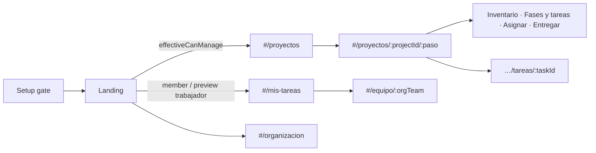
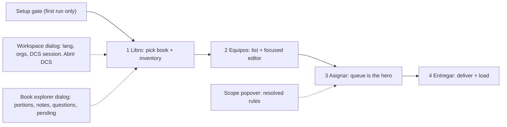

# Visual architecture — TAS (Translation Assistance System)

This document is the information-architecture plan for restructuring the
app. Interaction rules live in [`UI_UX_PRINCIPLES.md`](./UI_UX_PRINCIPLES.md);
platform model (issues, roles, routes) lives in [`PLATAFORMA.md`](./PLATAFORMA.md).
This file decides *what goes where* and *how much is visible at once*.

Spanish UI labels are quoted as they appear in the product.

---

## 0. Platform shell (current)

Domain vocabulary: **Proyecto → Fase → Tarea → Equipo → Subtarea**
([`MODELO.md`](./MODELO.md), migration [`PLAN_MIGRACION.md`](./PLAN_MIGRACION.md)).

### Visual system — Ink & paper

- Canvas: warm off-white (`--bg` / paper neutrals in `src/styles/tokens.css`).
- Text: deep ink (`--text`).
- Accent: **teal** only (`--primary`); no violet brand accent.
- Type: Geist Variable; TAS wordmark (`.app-mark`) is the strongest header signal.
- Atmosphere: soft fixed gradients on `.app-shell`, not flat gray-violet.
- Shell scroll: `.app-shell` fills the viewport; `.app-header` stays put;
  `.app-main` is the only vertical scrollport.

### Role preview (managers only)

| Concept | Source | Purpose |
|---------|--------|---------|
| `canManage` (real) | DCS org owner or `managers` team | Who sees the FAB and may call manager APIs |
| `viewMode` | `sessionStorage` key `tas-view-mode` | `"gestor"` \| `"trabajador"` — chrome and routes |
| `effectiveCanManage` | `canManage && viewMode === "gestor"` | All **UI** gates for Proyectos / wizard / org CRUD |

- Floating control: `RoleModeFab` (bottom-right), mounted only when real `canManage`.
- Preview never elevates a worker; it only demotes manager chrome.
- Switching to **Trabajador** leaves `#/proyectos` / `#/proyecto/*`; switching back to **Gestor** lands on `#/proyectos`.
- While previewing trabajador, a slim “Vista trabajador” chip sits above the FAB.

Hash routes replace the old global 4-step rail as primary navigation:



- Header: TAS mark + workspace chip + role nav (`Mis tareas` / `Proyectos` / `Organización`) + notification badge + breadcrumb inside a project.
- Hubs (`Proyectos`, `Mis tareas`, `Organización`) use the shared `.hub-*` board/queue layout.
- `StepNav` only appears inside a project. `:projectId` is the project slug (often a book code today, not always).
- Legacy `…/equipos` → `…/tareas`; `…/libro` → `…/inventario`.
- Entregar publishes **DCS issues** (source of truth) and can still save/download JSON.

---

## 1. Diagnosis (measured)

The previous shell was a 5-step wizard:

`Contexto → Inventario → Equipos → Asignar → Publicar`

Three different kinds of surface were flattened into one rail:

| Kind | Examples | How often |
|------|----------|-----------|
| One-time setup | lengua, orgs, DCS session | Once per workspace |
| Per-book prep | libro, inventario | Once per book |
| Repeated work | equipos, cola, entrega | Many times per book |

That flattening produced the density and scroll problems below.

### Header: 9–10 targets before content

Sticky header carried: title, context chip, DCS badge, username button,
"Abrir DCS", plus five step pills. Hick's Law applies before the user
reaches the step that matters.

### Equipos: ~50 controls at once

`TeamsView.tsx` (~1,258 lines) rendered people, presets, identity fields,
per-resource filter/grain/geo pickers, and a duplicated "Asignar juntos"
geo block on the same page. Chapter/portion pickers appeared once per
resource *and* again inside the bundle panel.

### Inventario: reference data in the flow

Four stat cards plus four drill-down collapsibles (each `max-h-80`) of
portions / notas / preguntas / pending articles sat between "Generar"
and the next step. Users scrolled past reference data to continue.

### Asignar: action scrolled away

A four-row toolbar (~300px) left the work list capped at `max-h-96`.
Selecting items and assigning required scrolling back up to the toolbar.

### Book selection in the wrong place

Libro lived in Contexto. Inventory cannot exist without a book — they are
one decision. The unused `listPmBooks()` API already existed for
"books in progress" recognition.

---

## 2. New information architecture



### Step rail (4 steps)

| # | id | Label | Unlocks when | Done when |
|---|----|-------|--------------|-----------|
| 1 | `inventario` | Inventario | Setup confirmed | Inventory loaded for current project |
| 2 | `tareas` | Fases y tareas | Setup confirmed | ≥1 task with scope |
| 3 | `asignar` | Asignar | Inventory present | Optional (self-claim via Entregar) |
| 4 | `entregar` | Entregar | Inventory present | Saved / downloaded this session (soft) |

Navigation stays a linear wizard (state-driven, no router). Steps show
done / current / locked states and optional counts.

### Surfaces removed from the rail

| Old | New home |
|-----|----------|
| Contexto (lang, orgs, book) | Setup gate (first run) + Workspace dialog; book → Libro |
| Inventory drill-downs | Book explorer dialog |
| Header "Abrir DCS" / session chrome | Workspace dialog |
| Duplicated PM org picker in Equipos | Workspace dialog only |

---

## 3. Per-screen wireframes

### 3.0 Header (always)

```
┌─────────────────────────────────────────────────────────┐
│ TAS             [es-419 · org ▾]  ●                      │
│  (1) Libro  (2) Equipos  (3) Asignar  (4) Entregar      │
└─────────────────────────────────────────────────────────┘
```

- One identity chip opens **Workspace**. Dot = DCS session (green/red).
- Step rail: done / current / locked; optional count badges.
- Budget: ≤ 6 interactive targets in the chrome (chip + 4 steps; mobile
  select counts as one).

### 3.1 Setup gate (first run only)

Shown when `gt-context-confirmed` is unset and there is no session inventory.

```
┌──────────── Setup ────────────┐
│ Lengua                        │
│ [es-419                    ]  │
│ Organización PM (opcional)    │
│ [—  ▾] / Iniciar sesión       │
│              [ Continuar ]    │
└───────────────────────────────┘
```

No book field. Advanced content-org stays in Workspace.

### 3.2 Libro (step 1)

```
┌─ Libro ─────────────────────────────────────────────────┐
│ En curso                                                │
│ [NEH] [TIT] [ROM]     or   Libro [NEH — Nehemías ▾]     │
├─────────────────────────────────────────────────────────┤
│ Inventario                                              │
│ [ Generar inventario ]  Cargar JSON                     │
│ (job status when running)                               │
├─────────────────────────────────────────────────────────┤
│ NEH · 42 porciones · 118 notas · 9 pendientes           │
│ [ Explorar el libro ]              [ Continuar → ]      │
└─────────────────────────────────────────────────────────┘
```

Empty state: dashed card + primary Generar. Explorer opens a dialog;
drill-downs never sit in the page flow.

### 3.3 Equipos (step 2) — Phase 2 target

**Default:** short team list + `+ Nuevo equipo`.

**Editor (create/edit):** focused surface with three sub-steps:

1. **Identidad** — nombre, descripción (optional), preset chips
2. **Alcance** — shared book ambit (capítulo/porciones once) + resource
   accordion (one open) + **Reparto** in three axes: empaquetado
   (separado/juntos, only if ≥2 resources), unidad (porción/capítulo),
   política de autoasignar (bloques contiguos / solo manual). Unidad:
   por porción, porciones por capítulo (sucesivo) o capítulo entero.
3. **Personas** — roster / manual add *inside* the editor (people only
   mean something on a team)

Sticky footer: Guardar / Guardar como preset / Cancelar.

Phase 1 keeps the current `TeamsView` wired to step id `equipos`.

### 3.4 Asignar (step 3) — list view (Asana / ClickUp / Monday)

```
┌ sticky assign-chrome ───────────────────────────────────┐
│ Traducir TPL · Alcance          [ Autoasignar outline ] │
│ Capítulos [▾]  Buscar […]  | Todos N | Sin asignar …    │
├ assign-board ───────────────────────────────────────────┤
│ ☐ N en vista          Trabajos | Porciones | Artículos  │
│     Nombre              Tipo      Persona     Estado    │
│ ☐ ▾ CAPÍTULO 1                                      5   │
│ ☐ 1:1–3                 TPL       ◯ Eli…      ● Asig.   │
│ … page scroll; groups collapse; no nested max-h         │
└─────────────────────────────────────────────────────────┘
┌ floating bulk bar (selection > 0) ──────────────────────┐
│ N sel.  Persona [▾]  [Asignar]  Liberar  Limpiar        │
└─────────────────────────────────────────────────────────┘
```

Principles applied:
- Identity → filters → list (Miller); Alcance / Autoasignar progressive.
- One primary in the bulk bar (**Asignar**); Autoasignar is outline.
- Group checkbox + master select; bulk actions only when selected.
- Status as color dots; assignee as avatar initials (recognition).
- Default filter **Todos**; chapters **collapse** when viewing all with >20 rows.
- Status chips: Todos / Sin asignar / Asignado; En curso / Hecho behind **Más**.
- Hide empty view tabs; hide **Tipo** when every row shares one kind.
- **Persona** filter next to chapter.
- Role FAB **parks left** on Asignar; lifts when bulk bar is open.

### 3.5 Entregar (step 4)

Confirm-and-publish: primary **Publicar** opens a confirm dialog with a
dry-run (`previewPublishWorkOrders`): N crear · M actualizar · K cerrar.
Warns when `scopeChanged` (orphans would close). Then outline Sincronizar +
**Más**. Summary shows consequential counts; help behind **¿Cómo funciona?**;
`settings.lastPublish` shows prior publish.

### Overlays

| Dialog | Opens from | Contents |
|--------|------------|----------|
| Workspace | Header chip | Lengua, content org (advanced), PM org, session, Abrir DCS, sign in/out |
| Setup gate | App (first run) | Lengua, PM org, Continuar |
| Book explorer | Libro → "Explorar el libro" | Portions / Notas / Preguntas / Pendientes drills |
| Sign in | Workspace / Setup | Existing `SignInModal` |
| Scope popover | Asignar badges (Phase 3) | Resolved rules read-only |

---

## 4. Cross-cutting patterns

1. **Progressive disclosure** — default state shows the next decision;
   advanced / reference / explanations behind one labeled click.
2. **Closed by default once you have data** — empty = open form; after
   first save, collapse to `+ Nuevo …`.
3. **Recognition over recall** — "En curso" book chips from local
   `gt-assignments:{lang}:*` and DCS `listPmBooks()`.
4. **One primary per section** — `variant="default"` once; secondaries
   are outline / ghost / link.
5. **Identity → status → filters → actions** as visual rows (Miller /
   Gestalt), never one wrapping blob.
6. **Collapse controls, not content** — entered data stays visible.
7. **Shared ambit, not copied geo** — one chapter/portion picker per
   screen; resources inherit it (Phase 2).

---

## 5. Density and scroll budgets (checkable)

Appended to the PR checklist in `UI_UX_PRINCIPLES.md`:

- [ ] Primary action of the current step is reachable at **1280×800**
      without scrolling.
- [ ] Step page ≤ **2 viewports** tall; long lists scroll **`.app-main`**
      under a fixed header (nav + StepNav), not the document and not inside
      a nested `max-h-*` box.
- [ ] ≤ **12** interactive targets visible in the default state of any
      step (overlays don't count until open).
- [ ] Reference data (drills, long help, resolved scope) lives in
      overlays, not in the flow.
- [ ] Repeated config blocks use a **single-open accordion**; a
      geo/scope control appears **once** per screen, never once per
      resource.

---

## 6. Phased roadmap

### Phase 1 — shell + Libro — **done**

- 4-step `StepNav` (`libro` | `equipos` | `asignar` | `entregar`)
- `WorkspaceDialog` + `SetupGate`; header = title + chip + status dot
- `BookStepView` + `BookExplorerDialog`; book picker with "en curso"
- `listLocalBooks(lang)`; wire `listPmBooks` when session + pmOrg
- Equipos / Asignar / Entregar keep current components, new step ids
- Docs linked from README and UI_UX_PRINCIPLES

### Phase 2 — Equipos list-detail + scope de-dupe — **done**

- List default; editor with Identidad → Alcance → Personas
- Shared book ambit; resource accordion; Reparto (empaquetado / unidad /
  política de autoasignar)
- Move personas out of a permanent top card into the editor

### Phase 3 — Asignar invert — **done**

- Sticky thin context bar; page-scrolled list; selection bottom bar
- Scope disclosure on badges; drop nested `max-h-96`

### Phase 4 — Entregar polish — **done**

- Soft "done" banner after save/download; clearer empty state
- One primary deliver action (DCS when available, else JSON)

---

## 7. Persistence and gating (unchanged contracts)

- `gt-context` — lang, contentOrg, pmOrg, book, host
- `gt-context-confirmed` — reused as setup-done (no migration)
- `gt-assignments:{lang}:{book}` — board per book
- `gt-session-inventory` — current inventory
- `gt-team-presets` / DCS `{pmOrg}/gateway-tasks/…` — unchanged paths

`stepEnabled`:

- `libro` — always after setup (setup gate blocks before rail)
- `equipos` — setup done
- `asignar` / `entregar` — setup done **and** inventory present

---

## 8. Success criteria

- Returning users with inventory land on Asignar (or Libro if none), not
  Contexto.
- Book change happens on Libro; header chip edits workspace, not book.
- Generating / loading inventory never requires scrolling past four
  drill-downs.
- Header interactive count ≤ 6 before step content.
- Typecheck and production build pass after Phase 1.
- **TPL and TPS** are assignable ScopeKeys (ULT → TPL, UST → TPS) on the
  shared ULT-`\ts` porciones; TPS requires UST confirmation (`hasUst`).

---

## 9. Scripture resources (TPL / TPS)

FCR translates both English scripture sources:

| Source (en) | Target (es) | ScopeKey | Grain |
|-------------|-------------|----------|-------|
| ULT | TPL | `tpl` | ítem / porción |
| UST | TPS | `tps` | ítem / porción |

Portion geometry is cut **only from ULT `\ts` markers** (same as
`prep_portions.py`). UST is not re-chunked; it confirms TPS on those ranges.
When UST is missing, `tps` count is 0 and TPS is not assignable.
